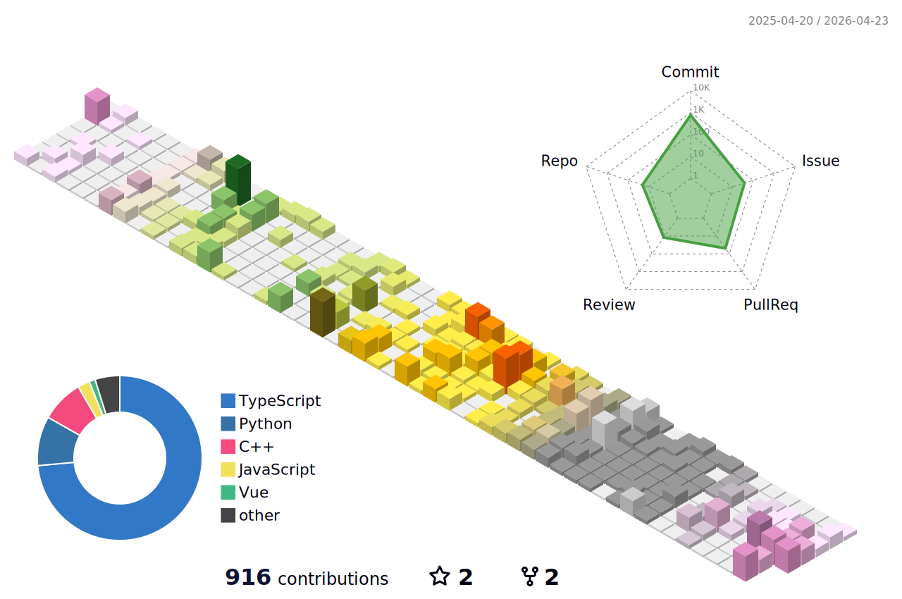

  <h2 style = "border-bottom : 1px;">🛠️</h2>
   
  

          
          
          
            
          
          
            
  

   
  

    <h2 style = "border-bottom : 1px;">🧑‍💻</h2>
     
    
    
    
    
  

  <h2 style="border-bottom: 1px solid #eaecef;"></h2>
   
  

  

